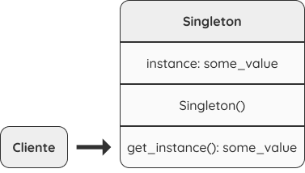
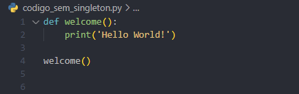
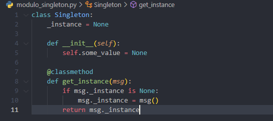
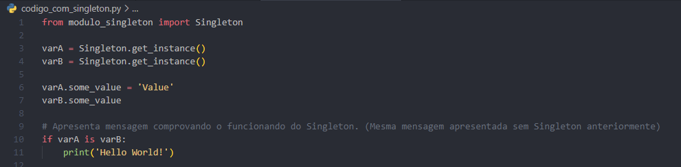

# Design Pattern - Singleton

Conhecido também como *“Carta Única”*, o padrão Singleton é considerado um dos mais simples designs patterns dentre os patterns **GoF**. A principal ideia desse padrão de desenvolvimento é garantir que uma classe tenha apenas uma instância durante todo o funcionamento da aplicação. 

Pensando em uma analogia com o mundo real, para tornar mais fácil o entendimento, podemos dizer que o governo é um excelente exemplo. Cada país possui apenas UM governo representante, independente da quantidade de pessoas que trabalham no mesmo.
Exemplo: Nós consideramos pessoas que trabalham no governo, como pessoas do “Governo A”.

## Estrutura:
A sua estrutura é muito simples, visando sempre manter uma única instância dentro do classe. Veja abaixo um exemplo de estrutura e aplicabilidade:

**+** O padrão Singleton deve ser utilizado quando uma classe da sua aplicação deve ter apenas uma instância disponível por vez para todos os seus clientes;

**-** O padrão Singleton desabilita outros meios de criar um objeto de classe, exceto pelo método desenvolvido.

**+** Recomendado usar o padrão Singleton quando é necessário um maior controle sobre as variáveis globais;

**-** O padrão Singleton irá garantir apenas uma instância de classe. Nenhum tipo de código fora da classe pode substituir a instância salva. 

**OBS.:** *Você pode ajustar o limite e permitir a criação de mais instâncias Singleton se a sua aplicação necessitar.* 

## Principais pontos positivos:
- Você terá sempre certeza que dentro de uma classe vai existir apenas uma instância;
- Você terá um acesso global para a instância criada;
- O objeto Singleton é inicializado somente quando for pedido pela primeira vez.

## Principais pontos negativos:
- Viola o princípio de responsabilidade única, pois resolve dois problemas de uma só vez;
- Dependendo do tamanho da sua aplicação, pode se tornar um trabalho difícil criar e realizar testes unitários do código principal, pois muitos frameworks de teste precisam de herança para produzir os objetos simulados;

## Frameworks: 
O Django é um dos frameworks que faz uso do padrão Singleton. O objeto de configuração *django.conf.settings* possui uma instância da classe *LazySettings*. Já a classe *LazySettings* do Django não implementa mecanismo de criação de instância para garantir o funcionamento do Singleton, pois o objeto settings foi declarado dentro do módulo *django.conf* e faz uso do mecanismo do Python de controle de módulos.

## Implementação:

1 - Crie um campo privado estático em uma classe para o armazenamento da instância Singleton;

2 - Declare um método de criação público estático para obter a instância criada;

3 - Você deverá criar uma inicialização dentro do método estático que será responsável por criar um novo objeto na primeira chamada e colocá-lo em campo estático. Todas as próximas chamadas retornarão a mesma instância;

4 - Crie o construtor da classe de modo com que ele seja privado. O método estático da classe continuará sendo capaz de chamar o construtor, mas não os demais objetos;

5 - Dentro do código cliente, substitua todas as chamadas diretas com o seu método de criação desenvolvido. 

## Exemplo de código sem Singleton: 

## Exemplo de código com Singleton: 

Link para apresentação: https://drive.google.com/file/d/1_0snUTQTgxSa1z6yp6Vbga1mRCMxlxkT/view?usp=sharing
